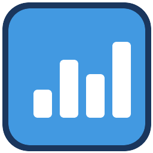
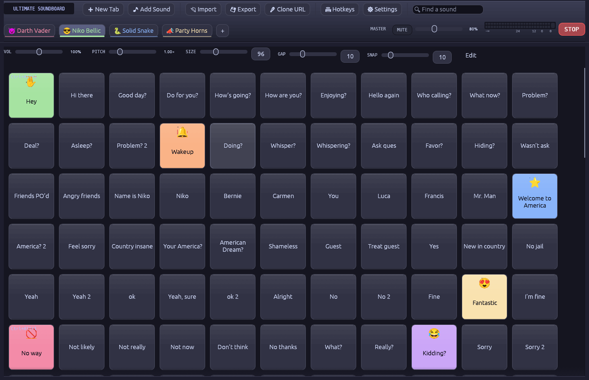
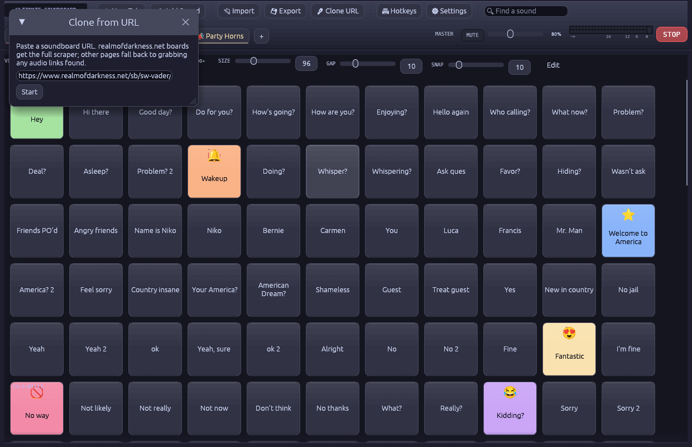
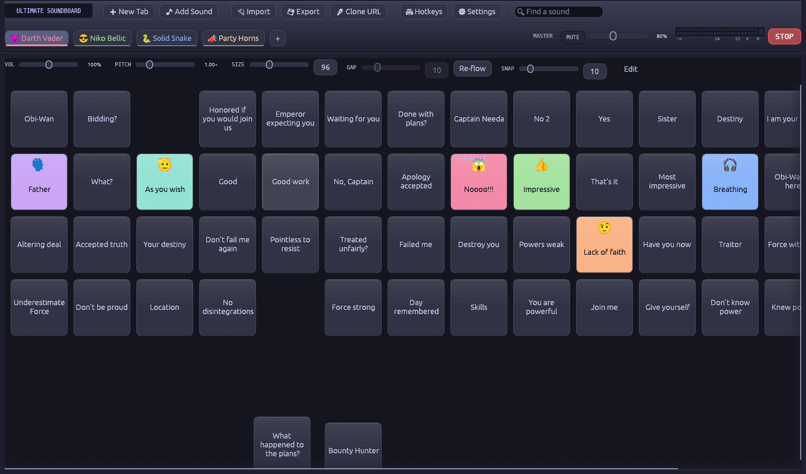
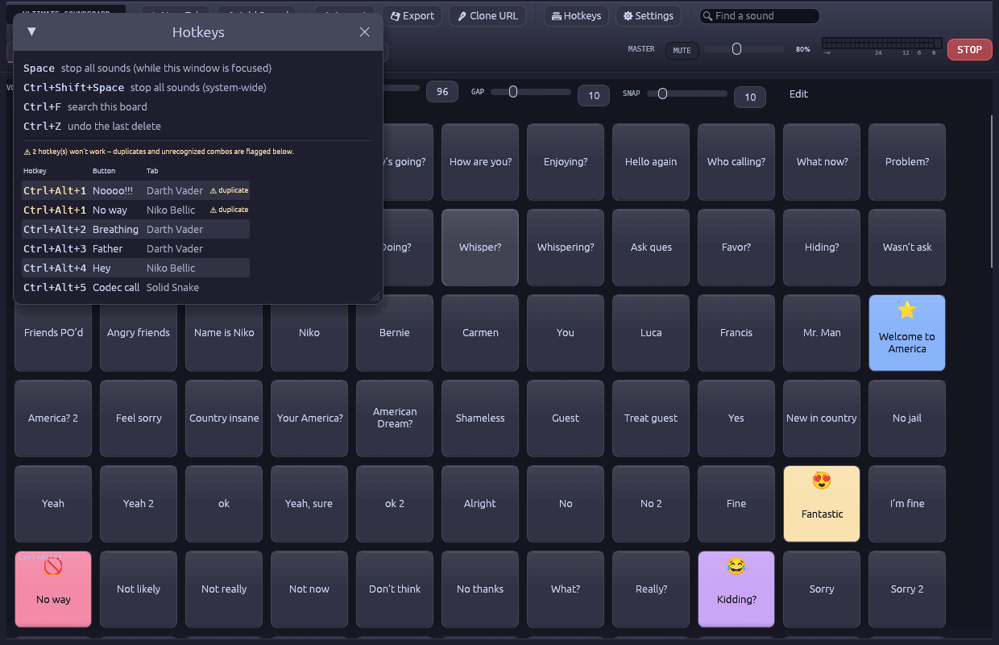
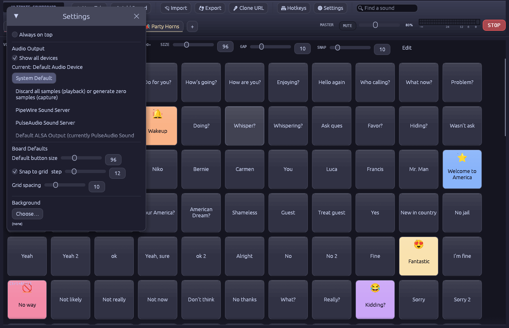

<p align="center">
  
</p>

<h1 align="center">Ultimate Soundboard</h1>

<p align="center">
  A soundboard you fill by dropping things on it: sound files, folders, <code>.zip</code> packs,
  even old Flash <code>.swf</code> soundboards. It takes the sounds out and never runs the file.
</p>

<p align="center">
  <a href="https://github.com/ZeroDay-Labz/ultimate-soundboard/releases/latest"></a>
  <a href="https://github.com/ZeroDay-Labz/ultimate-soundboard/actions/workflows/ci.yml"></a>
  <a href="https://github.com/ZeroDay-Labz/ultimate-soundboard/releases"></a>
  <a href="LICENSE"></a>
</p>

<p align="center">
  
</p>

## What is it?

It is a window full of buttons. Each button plays a sound. Click a button, hear the sound.

You don't have to build the buttons by hand. Drag a sound onto the window and you get a
button. Drag a whole folder and you get a whole page of buttons. Each page is a **tab**, and
you can have as many as you like.

It runs on Windows and Linux, and it can play into Discord or any other call.

## Drop it in

Drag any of these onto the window and let go:

| You drop | You get |
|---|---|
| Sound files (`.mp3`, `.wav`, `.ogg`, `.flac`, `.m4a`, ...) | One new button per file, on the tab you are looking at |
| A folder | A new tab named after the folder, with a button for every sound inside |
| A `.zip` | A soundboard someone shared with you, or a new tab from a zip of sounds |
| A `.swf` (old Flash soundboard) | A new tab with every sound from that board, named like the original buttons |

You can drop several things at once. A "Drop to add" label appears while you drag, so you
know the window sees it.

Dragging not working (some apps, like Discord, don't hand over a real file)? Use the
**Add Sound** and **Import** buttons at the top instead. They do the same thing.

## Share boards with friends

1. Click **Export** and pick where to save. You get one `.zip`.
2. Send that `.zip` to a friend any way you like.
3. Your friend drags the `.zip` onto their window (or clicks **Import**).

That's it. They now have your tabs, with the same sounds, names, colours, emoji, button
layout, volume, pitch and hotkeys. The sounds are inside the zip, so nothing is missing on
their end.

A plain zip of sound files with nothing else in it works too. It becomes one new tab.

## Old Flash soundboards, without running Flash

Old soundboards were often shared as `.swf` files. A `.swf` is a small program. To hear the
sounds you had to **run** it, with a Flash player that nobody keeps up to date any more.
Running an old program from a stranger is how people get into trouble.

Ultimate Soundboard does not run it. Think of the `.swf` as a locked box with sounds and a
stranger's instructions inside. This app opens the box, takes out the sounds, and never
reads the instructions.

- **Nothing in the file is ever run.** There is no Flash player and no script engine
  anywhere in this app. The parts of the file that hold code are skipped without being read.
- **It only copies out sound.** It also reads the words drawn on the board's buttons, so
  your new button says `THIS IS ANGEL` and not `Sound 24`.
- **Nothing else to install.** The common Flash sound types (ADPCM, MP3, raw PCM) are
  decoded by the app itself. No ffmpeg, no `swfextract`.
- **A broken file can't take the app down with it.** A damaged part costs you that one
  sound. The rest still import, and a message tells you how many were skipped and why.
  Two rare microphone formats (Nellymoser and Speex) are skipped and named.

One honest limit: this keeps the code in a `.swf` from ever running. It is not a virus
scanner for the rest of your computer.

## Clone a board from Realm of Darkness

[realmofdarkness.net](https://www.realmofdarkness.net/sb/) hosts hundreds of soundboards.
You can copy one into the app with a link.

<p align="center">
  
</p>

1. In your web browser, open the board you want on realmofdarkness.net. Its address looks
   like `https://www.realmofdarkness.net/sb/sw-vader/`.
2. Copy that address from the browser's address bar.
3. In Ultimate Soundboard, click **Clone URL**.
4. Paste the address into the box and click **Start**.
5. Wait. A list shows each sound as it downloads. A big board can take a minute.
6. Done. A new tab opens, named after the board, with one button per sound and the same
   button names as the website.

Good to know:

- Changed your mind? Click **Cancel** while it is working.
- "No sound buttons found" means the link is not a board page. Use the address of the
  page that shows the board's buttons, not the list of boards.
- Other websites work too, in a simpler way: paste any page and the app grabs the sound
  files that page links to.
- The sounds are saved on your computer, so the tab keeps working offline.
- Clone a board once and keep it. Please don't hammer the site.
- Flatpak users: cloning needs network access, which the v0.2.1 Flatpak is missing. It is
  fixed for the next release. The `.rpm` and Windows builds are fine.

## Safety and privacy

- **No file you import is ever run.** Not a `.swf`, not anything inside a `.zip`. Files
  are copied and played as sound, nothing more.
- **Zips can't write outside their own folder.** An entry that tries to escape it is skipped.
- **It stays off the internet** unless you click **Clone URL**. Then it talks only to the
  page you pasted and the sound files that page links to.
- **Your files stay where they are.** Sounds you add are used in place. They are not
  moved, copied or uploaded.
- **No account, no tracking, no ads.**
- **Open source** under the MIT license. You can read every line.
- One optional helper: [ffmpeg](https://ffmpeg.org), used only for Opus sounds (see
  [Troubleshooting](#troubleshooting)). Everything else is built in.

As with anything you download, only open zips from people you trust. The sounds inside can
still be loud or rude.

## Features

- **Tabs**: double-click to rename, right-click for an emoji and a colour, drag to reorder.
- **Grid or free-form**: let buttons line up by themselves, or switch to **Edit** and place
  each one where you want it.
- **Make it yours**: every button can have its own colour, emoji, picture, size and name.
- **Volume and pitch** per button and per tab. Pitch changes the tone without changing
  the speed. The sliders work on a sound while it is playing.
- **Stop everything** with `Space`. Sounds fade out fast and don't pop.
- **Hotkeys**: give any button a key combo and trigger it while you are in another app.
  The Hotkeys window lists them all and warns about duplicates.
- **Search** with `Ctrl+F` to find a sound on a big board.
- **Undo** a deleted button or tab with `Ctrl+Z`.
- **Duplicate** a button with a right-click.
- **Play into calls**: send the sound to any output device, including virtual cables.
- **Master volume, mute and a level meter** always in view.

<p align="center">
  
  
</p>

## Install

Download the latest file for your system from
[Releases](https://github.com/ZeroDay-Labz/ultimate-soundboard/releases/latest):

| System | File | How |
|---|---|---|
| Windows | `ultimate-soundboard-windows.zip` | Unzip it and double-click `ultimate-soundboard.exe`. No installer, no admin rights. |
| Fedora, openSUSE, RHEL | `ultimate-soundboard-*.x86_64.rpm` | `sudo dnf install ./ultimate-soundboard-*.rpm` |
| Any Linux (Flatpak) | `ultimate-soundboard.flatpak` | `flatpak install --user ./ultimate-soundboard.flatpak` |

Then start **Ultimate Soundboard** from your app menu
(Flatpak: `flatpak run io.github.zerodaylabz.UltimateSoundboard`).

### Build from source

Needs a current Rust toolchain. On Linux also the ALSA and GTK 3 headers
(`alsa-lib-devel gtk3-devel` on Fedora, `libasound2-dev libgtk-3-dev` on Debian/Ubuntu).

```sh
git clone https://github.com/ZeroDay-Labz/ultimate-soundboard && cd ultimate-soundboard
cargo run --release
```

## Using it

| Do this | To |
|---|---|
| Click a button | play its sound |
| Right-click a button | rename it, set colour, emoji, picture, volume, pitch, hotkey, or duplicate it |
| `Space` | stop all sounds (while the window is focused) |
| `Ctrl+Shift+Space` | stop all sounds from any app |
| `Ctrl+F` | search the current tab |
| `Ctrl+Z` | undo the last delete |
| Double-click a slider | put it back to its default |
| Double-click a tab | rename it |
| Right-click a tab | give it an emoji and a colour |
| Drag a tab | reorder tabs |
| **Edit** | move and resize buttons by hand |

## Play sounds into Discord or a call

Open **Settings** and pick where the sound goes.

<p align="center">
  
</p>

- **Windows**: install a virtual cable such as [Voicemeeter](https://voicemeeter.com), pick
  its input in Settings, then choose the Voicemeeter output as your microphone in Discord.
- **Linux** (PipeWire or PulseAudio): the soundboard shows up as its own stream. Route it
  wherever you like with `pavucontrol`, `qpwgraph` or `helvum`.

## Troubleshooting

- **Nothing happens when I drag a file from Discord.** Some apps don't give other programs
  a real file. Save the file to a folder first and drag it from there, or use **Add Sound**.
- **An Opus or Discord `.ogg` sound won't play.** Opus is the one format that needs
  [ffmpeg](https://ffmpeg.org). Install it, or on Windows put `ffmpeg.exe` next to
  `ultimate-soundboard.exe`. wav, mp3, flac, aac and ogg-vorbis need nothing extra.
- **Hotkeys only work while the window is focused (Linux).** Global hotkeys need X11.
  The app runs through XWayland by default to get them, and shows a small warning in
  the top bar when they are not available. Wayland itself gives apps no way to see keys
  while unfocused.
- **A hotkey does nothing.** Open **Hotkeys**. Two buttons on the same combo are flagged
  there, and only the first one fires.
- **The system-wide stop is `Ctrl+Shift+Space`, not `Space`.** A global hotkey takes its
  key away from every other program, so plain `Space` only works inside the window.

## Where your stuff is kept

Your boards are saved in `~/.local/share/ultimate-soundboard/` on Linux
(`~/.var/app/io.github.zerodaylabz.UltimateSoundboard/data/` under Flatpak) and
`%APPDATA%\ultimate-soundboard\` on Windows. Sounds you add yourself stay where they were.
Only cloned, zip-imported and `.swf`-ripped sounds are stored there, in
`downloaded-sounds/`, `imported_sounds/` and `swf-sounds/`.

## Building and contributing

Built with [`egui`](https://github.com/emilk/egui)/`eframe` in Rust.

```sh
cargo build --release
cargo test                                               # offline tests, what CI runs
cargo test -- --ignored --nocapture realm_of_darkness   # live test against the real site
```

- **Releases**: pushing a `vX.Y.Z` tag makes GitHub Actions build the `.rpm`, the Flatpak
  and the Windows zip and attach them to a release (`.github/workflows/ci.yml`).
- **RPM locally**: `cargo install cargo-generate-rpm && cargo build --release && cargo generate-rpm`.
- **Flatpak**: see [`packaging/flatpak/README.md`](packaging/flatpak/README.md).
- **Screenshots**: the app can photograph itself, which works on any compositor.
  `ULTIMATE_SOUNDBOARD_SCREENSHOT=out.png` saves the window and exits. Add
  `ULTIMATE_SOUNDBOARD_SCREENSHOT_VIEW=clone|hotkeys|settings` to open a dialog first and
  `ULTIMATE_SOUNDBOARD_SCREENSHOT_SIZE=1240x800` to set the window size. Point
  `XDG_DATA_HOME` at a scratch folder to use a demo profile instead of your own boards.
- **Emoji**: egui can't draw colour emoji as text, so the picker set is a pre-rendered
  image atlas (`assets/emoji/atlas.png`). After changing `EMOJIS` in
  `src/ui/emoji_picker.rs`, run `python3 tools/gen_emoji_atlas.py` (needs
  `python3-gobject`, `python3-cairo` and Noto Color Emoji). Other emoji fall back to the
  bundled monochrome Noto Emoji font (SIL OFL 1.1, `assets/fonts/NotoEmoji-OFL.txt`).
- **Wayland**: winit's Wayland backend has no drag-and-drop and `global-hotkey` is X11
  only, so the app prefers XWayland. Set `ULTIMATE_SOUNDBOARD_FORCE_WAYLAND=1` to opt out.

Bug reports and pull requests are welcome. See [CHANGELOG.md](CHANGELOG.md) for what changed.

## Notes

Ultimate Soundboard is not affiliated with realmofdarkness.net, Adobe or Discord. Sounds
you clone or import belong to their owners. Keep them for personal use.

## License

MIT, see [LICENSE](LICENSE).
